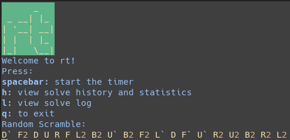
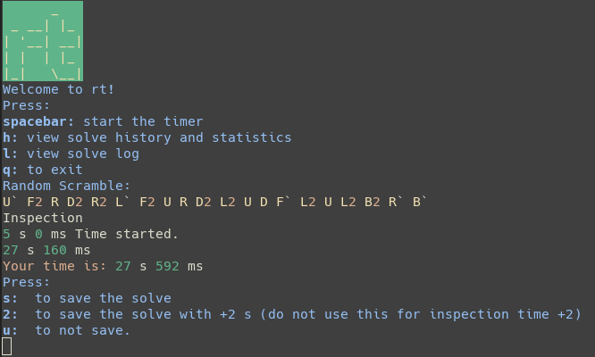
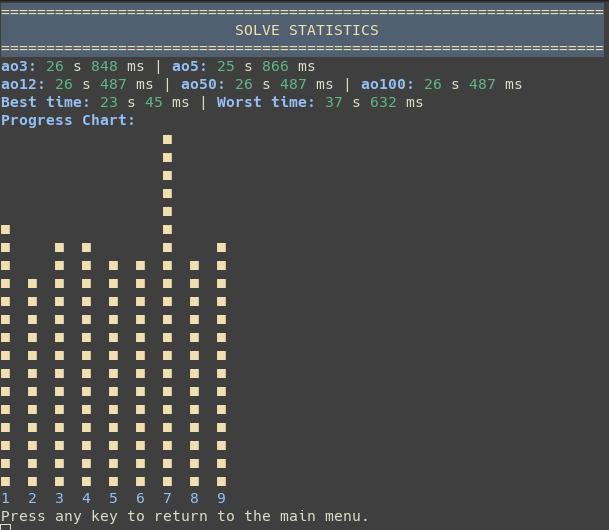
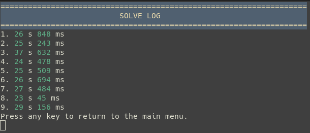

# rt  

Command Line Rubik's Cube Timer  

# Features
1. Timer (Duh)
2. Random Scramble
3. Solve Log
4. Statistics Page with ao3, ao5, ao50, ao100, and progress graph

# Screenshots
  
  
  
  
  

# License
GNU GPL V3
